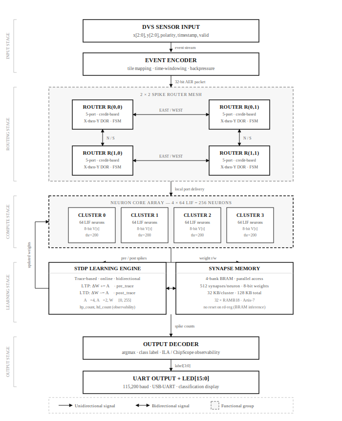
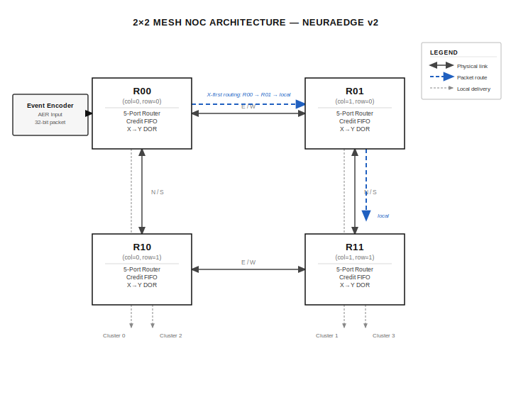

# NeuraEdge v2

> Independent RTL research project — a mesh-connected spiking neural network accelerator built from scratch in SystemVerilog, simulated with Verilator, and closed at 100 MHz on Artix-7.

[](#simulation)
[](#key-results)
[](#fpga-target--pin-map)
[](LICENSE)

---

Modern neuromorphic processors like Intel's Loihi and IBM's TrueNorth are notoriously difficult to understand. NeuraEdge v1 stripped the concept to its minimum — a single LIF core on a Basys 3. **NeuraEdge v2** takes the next step: a real mesh NoC, online STDP learning, DVS event input, and full timing closure at 100 MHz on Artix-7.

Every design decision favors clarity and reproducibility. This is not a toy — it synthesises, closes timing, and infers BRAM correctly. But every tradeoff is documented so you can understand *why*, not just *what*.

---

## Overview

- [Background](#background)
- [What Changed from v1](#what-changed-from-v1)
- [Architecture](#architecture)
- [Key Results](#key-results)
- [Repository Layout](#repository-layout)
- [Quick Start](#quick-start)
- [Simulation](#simulation)
- [FPGA Build](#fpga-build)
- [FPGA Target & Pin Map](#fpga-target--pin-map)
- [ASIC Migration Path](#asic-migration-path)
- [Roadmap](#roadmap)
- [Documentation](#documentation)

---

## Background

### Why neuromorphic hardware is hard

Three things make neuromorphic chip design fundamentally different from building a CPU or a matrix accelerator:

**1. Time is a first-class citizen.** Spike timing encodes information. The *when* of a spike is as important as the *whether*. This forces the router and learning engine to carry timestamps, not just data.

**2. Memory and compute are entangled.** Synaptic weights live next to neuron cores — breaking the classical CPU/RAM separation. Every routing decision is also a memory access. BRAM inference correctness is non-negotiable.

**3. Learning is local.** Backpropagation needs global gradients. STDP updates a single synapse using only the timing of its two endpoints. This has to happen in hardware, in real time, without stalling the pipeline.

NeuraEdge v2 addresses all three. The design is small enough to understand completely, real enough to synthesise without modification.

---

## What Changed from v1

| Feature | v1 (Basys 3 baseline) | v2 (this project) |
|---|---|---|
| Neurons | 32 / 128 (two configs) | 256 total (4 clusters × 64) |
| Interconnect | AER bus, flat | 2×2 mesh NoC, credit flow control |
| Routing | Priority encoder, 4-state FSM | X-then-Y DOR, 5-state FSM |
| Learning | STDP (offline) | Trace-based STDP, online, bidirectional |
| Input | Rate / temporal encoded | DVS-style event stream (x, y, polarity, timestamp) |
| Memory | Single BRAM per config | 4-bank banked BRAM, 32 KB/cluster, 128 KB total |
| Timing closure | ~180 MHz (Artix-7 35T) | 100 MHz, WNS +0.112 ns (Artix-7 100T) |
| Debug | LEDs only | UART telemetry + ILA ChipScope |
| ASIC path | Not targeted | Synthesisable for OpenLane / SKY130 |

---

## Architecture

### System overview



### LIF neuron core

The fundamental compute unit is the **Leaky Integrate-and-Fire (LIF) neuron** — the biological neuron reduced to its essential electrical behaviour.

A biological neuron integrates incoming current on its membrane capacitance and fires an action potential when voltage exceeds threshold. The "leaky" part comes from passive membrane resistance that continuously drains charge back toward rest.

In hardware:

```
V[t+1] = (V[t] >> LEAK_SHIFT) + I_syn[t]   // integrate + leak

if V[t+1] >= THRESHOLD:
    emit spike
    V[t+1] = 0                               // fire + reset
```

NeuraEdge v2 uses `THRESHOLD=200`, `LEAK_SHIFT=1` (50% leak per cycle), 8-bit membrane datapath. All 64 neurons in a cluster update in parallel every clock cycle — no time-multiplexing, no iteration.

### Spike router (mesh NoC)

The router implements a 5-port (N/S/E/W/local) credit-based mesh with **X-then-Y dimension-order routing** — deadlock-free by construction.



Credits prevent FIFO overflow without backpressure stalls. Each router tracks available downstream FIFO space and only forwards when credit > 0. At 10% firing rate (~6 spikes/timestep/cluster), routing overhead is ~24 cycles per timestep per cluster.

### Synapse memory

4-bank BRAM layout for parallel weight access. `NUM_SYNAPSES=512` per neuron, `WEIGHT_W=8`:

```
Bank 0: W[pre][synapses 0..127]
Bank 1: W[pre][synapses 128..255]
Bank 2: W[pre][synapses 256..383]
Bank 3: W[pre][synapses 384..511]

All 4 banks read in parallel → all 512 weights for one pre-neuron in 1 cycle
```

32 KB per cluster → 128 KB total → **32 RAMB18** on Artix-7. Reset logic was removed from the BRAM read-port register in v2.5.0 to restore correct BRAM18 inference after a regression in v2.4.0 — this is the most common FPGA gotcha with BRAM: any reset on the output register forces the synthesiser to use distributed RAM instead.

### STDP learning engine

**Spike-Timing-Dependent Plasticity** updates weights using only local information: the relative timing of pre- and post-synaptic spikes. No global error signal, no backpropagation.

The biological rule:
- Pre fires **before** post → strengthen synapse (Long-Term Potentiation)
- Pre fires **after** post → weaken synapse (Long-Term Depression)

v2 implements **trace-based** STDP — each neuron maintains a running eligibility trace that decays over time, which is more hardware-efficient than tracking exact spike timestamps:

```
pre_trace[i]  += TRACE_INCR on pre-spike,  decays >>TRACE_DECAY each cycle
post_trace[j] += TRACE_INCR on post-spike, decays >>TRACE_DECAY each cycle

On pre-spike:   W[i][j] -= A_MINUS * post_trace[j]   // LTD
On post-spike:  W[i][j] += A_PLUS  * pre_trace[i]    // LTP
```

Parameters: `A_PLUS=4`, `A_MINUS=2`, `TRACE_INCR=16`, `TRACE_DECAY=3`. Weights saturate to `[0, 255]`. The engine exposes `ltp_count`, `ltd_count`, and `scan_active` for observability via UART/ILA.

### Event encoder

Converts DVS-style events `(x, y, polarity, timestamp, valid)` into AER packets for the mesh. Maps sensor coordinates to cluster addresses using the tile formula: `neuron_id = (y/TILE_H)*TILE_W + (x/TILE_W)`. Supports optional time-windowing mode (`WINDOW_MODE`, `WINDOW_US=1000`). Tracks accepted/dropped event counters and applies backpressure via `pkt_ready`.

**Tile constraint** (checked at synthesis via `$fatal`):

```
TILE_W * TILE_H * 2 <= 2^NEURON_ADDR_W
// Default: 4 * 4 * 2 = 32 <= 64 = 2^6  ✅
```

---

## Key Results

Timing closure on `xc7a100tcsg324-1` (Artix-7 100T), 100 MHz, Vivado 2024.x, post-route:

| Metric | Value |
|--------|-------|
| WNS | **+0.112 ns** ✅ |
| TNS | 0.000 ns |
| WHS | **+0.050 ns** ✅ |
| THS | 0.000 ns |
| BRAM18 | 32 (8 per cluster × 4 clusters) |
| LUTs | ~2,100–2,300 |
| FFs | ~1,400–1,600 |
| DSPs | 0 |
| DRC errors | 0 |

Reference report: [`reports/timing_summary_postchange.rpt`](reports/timing_summary_postchange.rpt)

---

## Repository Layout

```
neuraedge/
├── rtl/                          # Synthesisable RTL (Verilog-2001 compatible)
│   ├── neuraedge_top.v           # Top-level: 2×2 mesh, UART, LEDs
│   ├── neuraedge_top_ila.v       # ILA debug wrapper (ChipScope)
│   ├── event_encoder.v           # DVS event → AER packet
│   ├── spike_router.v            # Mesh NoC router (credit, X-then-Y DOR)
│   ├── neuron_core.v             # LIF neuron array (64 neurons/cluster)
│   ├── synapse_memory.v          # 4-bank BRAM weight store
│   └── learning_engine.v         # Trace-based STDP engine
├── tb/                           # Testbenches
│   ├── *.v                       # Icarus Verilog (X-propagation checks)
│   └── tb_*.cpp                  # Verilator C++ (primary regression)
├── constraints/
│   └── neuraedge.xdc             # Nexys A7-100T pins + timing constraints
├── scripts/
│   ├── sim/
│   │   ├── run_sim.sh            # Verilator regression (all 6 modules)
│   │   └── run_iverilog.sh       # Icarus Verilog alternative
│   └── vivado/
│       ├── synth.tcl             # Synth + impl + bitstream (batch mode)
│       ├── synth_ila.tcl         # ILA-enabled build
│       ├── synth_bram_fix.tcl    # BRAM inference debug flow
│       ├── pre_bitgen.tcl        # Pre-bitstream hook
│       └── ila_capture_to_csv.tcl
├── docs/
│   ├── architecture.md           # Module specs, parameters, interfaces
│   ├── timing_strategy.md        # Constraint rationale, closure approach
│   ├── scaling.md                # Scaling neurons, mesh, ASIC migration
│   ├── ila_guide.md              # ILA ChipScope setup
│   ├── ila_bringup_guide.md      # Board bring-up checklist
│   ├── expected_outputs.md       # Reference sim/synth outputs
│   └── sim_hardware_disclaimer.md
├── reports/                      # Reference timing reports (committed)
├── software/
│   ├── train_nmnist.py           # N-MNIST training pipeline
│   ├── benchmark.py              # Throughput benchmark
│   └── requirements.txt
├── Makefile                      # make sim / synth / clean / help
├── .gitignore
└── LICENSE                       # Apache 2.0
```

---

## Quick Start

### Prerequisites

| Tool | Version | Install |
|------|---------|---------|
| Verilator | ≥ 5.0 | `apt install verilator` |
| make + g++ | any recent | `apt install build-essential` |
| Icarus Verilog | ≥ 11 | `apt install iverilog` (optional) |
| Vivado | 2024.x+ | [Xilinx downloads](https://www.xilinx.com/support/download.html) |
| Python | ≥ 3.10 | for software utilities only |

### Clone & run

```bash
git clone https://github.com/anykrver/neuraedge-v2
cd neuraedge-v2

# Full simulation regression
make sim

# FPGA bitstream (requires Vivado in PATH)
make synth
```

### Python environment (optional)

```bash
python -m venv .venv && source .venv/bin/activate
pip install -r software/requirements.txt
```

---

## Simulation

```bash
# Verilator — full regression (all 6 modules)
make sim

# Single module
make sim MOD=neuron_core
make sim MOD=spike_router
make sim MOD=learning_engine

# Open GTKWave waveform on first VCD
make sim-wave

# Icarus Verilog — catches X-propagation issues Verilator masks
make sim-iv
```

Expected output:

```
[PASS] neuron_core:     Results: 12/12 checks passed
[PASS] synapse_memory:  Results: 8/8 checks passed
[PASS] spike_router:    Results: 10/10 checks passed
[PASS] event_encoder:   Results: 6/6 checks passed
[PASS] learning_engine: Results: 9/9 checks passed
[PASS] neuraedge_top:   Results: integration test passed
ALL TESTS PASSED
```

For a detailed breakdown of what simulation validates vs what requires hardware, see [`docs/sim_hardware_disclaimer.md`](docs/sim_hardware_disclaimer.md).

---

## FPGA Build

```bash
# Synthesis + implementation + bitstream
make synth

# With ILA ChipScope debug cores (~8 BRAM18 overhead)
make synth-ila

# Override Vivado binary path
make synth VIVADO=/opt/Xilinx/Vivado/2024.2/bin/vivado
```

Outputs land in `vivado_proj/neuraedge.runs/impl_1/`:

| File | Description |
|------|-------------|
| `neuraedge_top.bit` | Bitstream — verify WNS ≥ 0 before programming |
| `timing.rpt` | WNS / TNS / WHS / THS |
| `utilisation.rpt` | LUT / FF / BRAM / DSP counts |
| `power.rpt` | Estimated dynamic power |
| `drc.rpt` | DRC violations (automated check fails build if > 0) |

`synth.tcl` includes automated post-implementation checks: BRAM count < 30 fails the build, DRC violations > 0 fail the build, WNS < 0.3 ns prints a warning before programming.

---

## FPGA Target & Pin Map

| Property | Value |
|----------|-------|
| Board | Nexys A7-100T |
| Device | `xc7a100tcsg324-1` |
| Clock | E3 — 100 MHz crystal oscillator |
| Reset | C12 — CPU_RESET button, active-low |
| DVS x[2:0] | J15 / L16 / M13 (SW0–SW2) |
| DVS y[2:0] | R15 / R17 / T18 (SW3–SW5) |
| DVS polarity | U18 (SW6) |
| DVS valid | N17 (BTNC centre) |
| Window advance | M18 (BTNU up) |
| SPI weight load | C17 / D18 / E18 (PMOD JA) |
| UART TX | D4 — USB-UART bridge, 115,200 baud |
| Classification out | LED[15:0] |

Full constraint rationale (false-path decisions, rst_n hold strategy, dvs_ready DRC fix) is in [`docs/timing_strategy.md`](docs/timing_strategy.md).

---

## ASIC Migration Path

The RTL is written in Verilog-2001-compatible style with no FPGA primitives in the design proper. It passes Yosys synthesis without modification. The primary FPGA-specific element is BRAM18 inference in `synapse_memory.v`, which must be replaced with an SRAM macro for SKY130.

See [`docs/scaling.md`](docs/scaling.md) for the full migration checklist and neuron/mesh scaling tables.

---

## Roadmap

- [ ] AXI-Lite configuration interface (replace SPI weight loader)
- [ ] 4×4 mesh expansion — 1,024 neurons, 4 MB synaptic storage
- [ ] OpenLane / SKY130 floorplan + SRAM macro integration
- [ ] Real N-MNIST end-to-end inference demo on hardware
- [ ] Coverage-driven verification (SystemVerilog functional coverage)
- [ ] Pipeline STDP scan path → target 150 MHz

---

## Documentation

| Document | Description |
|----------|-------------|
| [docs/architecture.md](docs/architecture.md) | Module responsibilities, parameters, external interfaces |
| [docs/timing_strategy.md](docs/timing_strategy.md) | XDC rationale, constraint decisions, known risks |
| [docs/scaling.md](docs/scaling.md) | Scaling neurons, mesh size, ASIC migration |
| [docs/ila_guide.md](docs/ila_guide.md) | ILA ChipScope debug setup |
| [docs/ila_bringup_guide.md](docs/ila_bringup_guide.md) | Board bring-up checklist |
| [docs/expected_outputs.md](docs/expected_outputs.md) | Reference simulation and synthesis outputs |
| [docs/sim_hardware_disclaimer.md](docs/sim_hardware_disclaimer.md) | What simulation validates vs what needs hardware |

---

## Tech Stack

- **HDL**: SystemVerilog / Verilog-2001 compatible RTL
- **Simulation**: Verilator ≥5.0 (primary), Icarus Verilog ≥11 (X-propagation)
- **FPGA**: Vivado 2024.x, Artix-7 `xc7a100tcsg324-1`
- **ASIC**: OpenLane + SkyWater SKY130 (migration path)
- **Scripting**: Bash, Tcl, Python 3.10+

---

## Acknowledgements

Inspired by [tiny-gpu](https://github.com/adam-maj/tiny-gpu) — the clearest hardware architecture tutorial written.

Neuron model based on: Gerstner & Kistler (2002). *Spiking Neuron Models*. Cambridge University Press.

STDP rule based on: Bi & Poo (1998). Synaptic modifications in cultured hippocampal neurons. *Journal of Neuroscience*, 18(24).

---

## License

Apache 2.0. See [LICENSE](LICENSE).
