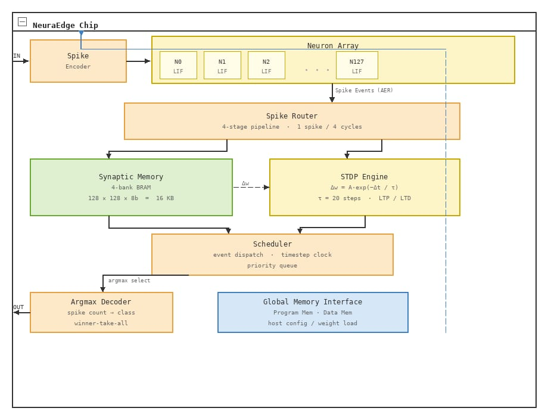

# Architecture

NeuraEdge is a minimal but complete neuromorphic processing chip implemented in SystemVerilog. It is designed to make the core principles of spike-based, event-driven computation easy to understand and simulate.

## Top-Level Pipeline

```
Spike Input → Encoder → Neuron Array → Spike Router → Output Decoder
                                ↕
                        Synaptic Memory (BRAM)
                                ↕
                        STDP Learning Engine
                                ↑
                           Scheduler
```

The **Scheduler** orchestrates every stage, advancing a global timestep counter and issuing control signals that move data through the pipeline.

## Two Configurations

NeuraEdge ships in two ready-to-use configurations. They share the same neuron core, encoder, scheduler, and STDP engine, differing only in memory width and router pipeline depth.

| Feature            | 32-neuron XOR baseline     | 128-neuron MNIST             |
|--------------------|----------------------------|------------------------------|
| Top-level file     | `neuraedge.sv`             | `neuraedge_mnist.sv`         |
| Synaptic memory    | 32×32 × 8-bit = 1 KB       | 128×128 × 8-bit = 16 KB      |
| BRAM banks         | 1 (BRAM18K)                | 4 parallel banks             |
| Router FSM states  | 4 (single-cycle read)      | 5 (2-cycle pipelined read)   |
| Router throughput  | 3 cycles / spike event     | 4 cycles / spike event       |
| Target board       | Basys 3 (Artix-7 35T)      | Larger Artix-7 device        |
| FPGA wrapper       | `neuraedge_top.sv`         | —                            |

## Architecture Diagram



*The 128-neuron MNIST configuration. The 32-neuron baseline uses the same pipeline with a single-bank BRAM and a simpler 4-state router.*

## Module Breakdown

### Encoder (`encoder.sv`)
Converts raw input values (0–255) into spike trains using either rate coding or temporal (time-to-first-spike) coding. See [encoder.md](encoder.md) for full details.

### Neuron Array (`neuron_array.sv` / `neuron.sv`)
N parallel Leaky Integrate-and-Fire (LIF) neurons that integrate synaptic currents and emit spikes every clock cycle. See [neuron.md](neuron.md) for full details.

### Synaptic Memory (`synapse_mem.sv` / `synapse_mem_128.sv`)
Stores the weight matrix `W[pre][post]` in dual-port BRAM.

**32-neuron layout:**
```
Row    = pre-synaptic neuron index
Column = post-synaptic neuron index

W[0][0]  W[0][1]  ...  W[0][31]   ← weights FROM neuron 0
W[1][0]  W[1][1]  ...  W[1][31]
...
W[31][0] W[31][1] ...  W[31][31]  ← weights FROM neuron 31
```

**128-neuron 4-bank layout:**
```
Bank 0: W[pre][0..31]    ← first  32 post-synaptic columns
Bank 1: W[pre][32..63]
Bank 2: W[pre][64..95]
Bank 3: W[pre][96..127]  ← last   32 post-synaptic columns

All 4 banks read in parallel → 128 weights available after 2 cycles.
```

### Spike Router (`spike_router.sv` / `spike_router_128.sv`)
Implements an **Address-Event Representation (AER)** bus. When a neuron fires, the router reads its weight row from synaptic memory and accumulates the weights into the synaptic-current registers of the target neurons.

**32-neuron FSM:**
```
IDLE → ARBITRATE → READ_MEM → ACCUMULATE → (loop) → DONE
```

**128-neuron pipelined FSM:**
```
S_IDLE → S_ARBITRATE → S_WAIT_RD1 → S_WAIT_RD2 → S_ACCUMULATE → (loop) → DONE
```

### STDP Learning Engine (`stdp.sv`)
Implements **Spike-Timing-Dependent Plasticity** — a local Hebbian learning rule:
- Pre fires **before** post → synapse strengthens (Long-Term Potentiation).
- Pre fires **after** post → synapse weakens (Long-Term Depression).

An LUT approximates the exponential weight-change curve to avoid costly multipliers.

### Scheduler (`scheduler.sv`)
10-state FSM that drives the entire timestep loop. See [scheduler.md](scheduler.md) for full details.

### Decoder (`decoder.sv`)
Argmax decoder: counts spikes from each output neuron over the inference window and returns the index of the neuron that fired the most — the predicted class label.

## Execution Flow Per Timestep

1. **ENCODE** — Encoder converts inputs to spikes for this timestep.
2. **INTEGRATE** — Neurons add incoming synaptic currents to their membrane potentials.
3. **FIRE** — Neurons whose potential exceeds threshold emit spikes and reset.
4. **ROUTE** — Spike router distributes output weights to downstream neurons.
5. **LEARN** — STDP engine updates weights (skipped during inference-only mode).
6. **ADVANCE** — Timestep counter increments; loop repeats until `t_max`.

## Directory Layout

```
neuraedge/
├── src/
│   ├── neuraedge.sv          # Top-level chip (32-neuron XOR baseline)
│   ├── neuraedge_mnist.sv    # Top-level chip (128-neuron MNIST)
│   ├── neuraedge_top.sv      # Basys 3 FPGA board wrapper
│   ├── neuron.sv             # LIF neuron core
│   ├── neuron_array.sv       # Parallel neuron array (N neurons)
│   ├── synapse_mem.sv        # Synaptic weight BRAM (32×32, single bank)
│   ├── synapse_mem_128.sv    # Synaptic weight BRAM (128×128, 4-bank)
│   ├── spike_router.sv       # AER event bus & routing (32-neuron)
│   ├── spike_router_128.sv   # Pipelined AER router (128-neuron)
│   ├── stdp.sv               # Spike-Timing-Dependent Plasticity engine
│   ├── scheduler.sv          # Event-driven timestep controller
│   ├── encoder.sv            # Rate / temporal spike encoder
│   └── decoder.sv            # Argmax spike-count output decoder
├── tests/
│   ├── neuron_tb.sv          # Single neuron unit tests
│   ├── network_tb.sv         # XOR integration tests (9 phases)
│   └── mnist_tb.sv           # 128-neuron MNIST testbench (8 phases)
├── kernels/
│   ├── xor_network.py        # XOR spike-encoded simulation
│   ├── pattern_classify.py   # 4-class pattern recognition
│   └── mnist_train.py        # MNIST SNN training + weight export
├── weights/                  # Generated weight files (git-ignored)
└── docs/
    └── images/
        ├── architecture.jpeg # Top-level block diagram
        ├── architecture.md   # This file
        ├── neuron.md         # LIF neuron core details
        ├── scheduler.md      # Scheduler FSM details
        └── encoder.md        # Spike encoder details
```

## Design Philosophy

NeuraEdge deliberately omits production-grade complexity (multi-core mesh routing, on-chip learning rate adaptation, JTAG debug interfaces) to keep every subsystem readable and simulatable on a laptop. The goal is to make the *principles* of neuromorphic hardware — event-driven execution, co-located memory and compute, local learning rules — tangible and experimentable.
